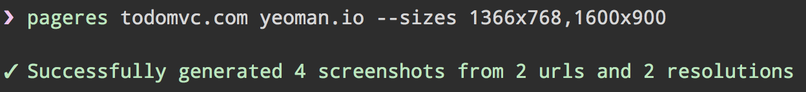
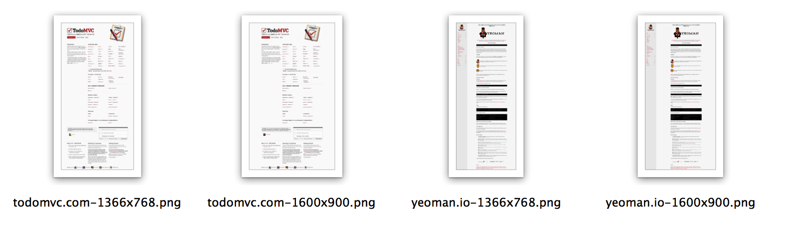

# pageres [](https://travis-ci.org/sindresorhus/pageres)

> Get screenshots of the websites in different resolutions

A good way to make sure your websites are responsive.

It's speedy and generates 100 screenshots from 10 different websites in just over a minute.






## CLI app

### Install

```
npm install --global pageres
```

### Usage

```
$ pageres --help

Get screenshots of websites in different resolutions.

Usage
  pageres <url> [<url> ...] --sizes <resolution>,[<resolution>,...]
  pageres <url> [<url> ...] --file <filepath>

Example
  pageres todomvc.com yeoman.io --sizes 1366x768,1600x900

If --sizes is not specified it will fall back to the ten most popular screen resolutions according to w3counter.

The <filepath> file should be formatted to have one <resolution> on each line.
```


## Programmatic API

### Install

```
npm install --save pageres
```

### Example

```js
var pageres = require('pageres');

pageres(['todomvc.com'], ['1366x768', '1600x900'], function () {
	console.log('done');
});
```


## Google Analytics screen resolutions

You can use the most popular resolutions for your site with `pageres` by following these steps:

- In Google Analytics go to the site for which you want screen resolutions
- Select `Audience` => `Technology` => `Browser & OS`
- Click the `Screen Resolution` link in the middle of the screen
- Click the `Export` button at the top, then `Google Spreadsheets`, and select yes for importing
- Select all the resolutions and copy them into a new file and save it
- In your terminal run: `pageres website.com --file file-from-above-step.txt`


## License

MIT © [Sindre Sorhus](http://sindresorhus.com)
