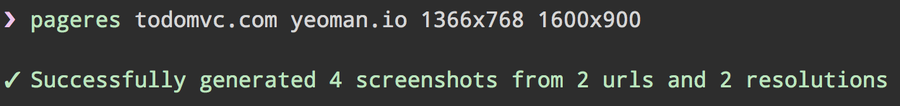
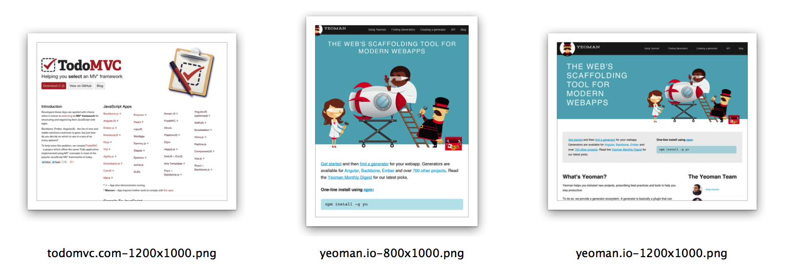

# 

> Responsive website screenshots

[](https://travis-ci.org/sindresorhus/pageres) 

Capture screenshots of websites in various resolutions. A good way to make sure your websites are responsive.

It's speedy and generates 100 screenshots from 10 different websites in just over a minute.






## Install

```sh
$ npm install --global pageres
```

*PhantomJS, which is used for generating the screenshots, is installed automagically, but in some [rare cases](https://github.com/Obvious/phantomjs/issues/102) it might fail to and you'll get an `Error: spawn EACCES` error. [Download](http://phantomjs.org/download.html) PhantomJS manually and reinstall pageres if that happens.*


## Usage

```
$ pageres --help

Specify urls and screen resolutions as arguments. Order doesn't matter. Group arguments with [ ]
Screenshots are saved in the current directory.

Usage
  pageres <url> <resolution>
  pageres [ <url> <resolution> ] [ <url> <resolution> ]
  pageres [ <url> <resolution> ... ] < <file>
  cat <file> | pageres [ <url> <resolution> ... ]

Example
  pageres todomvc.com yeoman.io 1366x768 1600x900
  pageres [ yeoman.io 1366x768 1600x900 ] [ todomvc.com 1024x768 480x320 ]
  pageres --delay 3 1366x768 < urls.txt
  pageres unicorn.html 1366x768
  cat screen-resolutions.txt | pageres todomvc.com yeoman.io

Options
  -d, --delay <seconds>    Delay capturing the screenshot
  -c, --crop               Crop to the set height
  --cookie <cookie>        Browser cookie, can be set multiple times

<url> can also be a local file path.

You can also pipe in a newline separated list of urls and screen resolutions which will get merged with the arguments. If no screen resolutions are specified it will fall back to the ten most popular ones according to w3counter.
```


## Task runners

Check out [grunt-pageres](https://github.com/sindresorhus/grunt-pageres) if you're using grunt. 

For gulp and broccoli, just use the below API directly. No need for a wrapper plugin.  
*(If you create a useless gulp/broccoli wrapper plugin for this, my cat will be very sad.)*


## API

### Install

```sh
$ npm install --save pageres
```

### Usage

```js
var Pageres = require('pageres');

var pageres = new Pageres({delay: 2})
	.src('yeoman.io', ['480x320', '1024x768', 'iphone 5s'])
	.src('todomvc.com', ['1280x1024', '1920x1080'])
	.dest(__dirname);

pageres.run(function (err) {
	if (err) {
		throw err;
	}

	console.log('done');
});
```


### Pageres(options)

#### options

##### delay

Type: `number` *(seconds)*  
Default: `0`

Delay capturing the screenshot.

Useful when the site does things after load that you want to capture.

##### crop

Type: `boolean`  
Default: `false`

Crop to the set height.

##### cookies

Type: `array`  

Same format as a [browser cookie](http://en.wikipedia.org/wiki/HTTP_cookie).

###### Tip

Go to the website you want a cookie for and copy-paste it from Dev Tools.


### pageres.src(url, sizes)

Add a page to screenshot.

#### url

*Required*  
Type: `string`

URL or local path to the website you want to screenshot.

#### sizes

*Required*  
Type: `array`

Use a `<width>x<height>` notation or a keyword.

A keyword is a version of a device from [this list](http://viewportsizes.com).
You can also pass in the `w3counter` keyword to use the ten most popular 
resolutions from [w3counter](http://www.w3counter.com/globalstats.php).

### pageres.dest(directory)

Set the destination directory.

#### directory

Type: `string`

### pageres.run(callback)

Run pageres.

#### callback(error, [items])

Type: `function`

If you don't set a `dest()` you'll get `items` in this callback, which is an array of streams.


## Google Analytics screen resolutions

You can use the most popular resolutions for your site with `pageres` by following these steps:

- In Google Analytics go to the site for which you want screen resolutions
- Select `Audience` => `Technology` => `Browser & OS`
- Click the `Screen Resolution` link in the middle of the screen
- Click the `Export` button at the top, then `Google Spreadsheets`, and select yes for importing
- Select all the resolutions and copy them into a new file and save it
- In your terminal run: `pageres website.com < file-from-above-step.txt`


## Credit

[](http://sindresorhus.com) | [](https://github.com/kevva)
---|---
[Sindre Sorhus](http://sindresorhus.com) (creator) | [Kevin Mårtensson](https://github.com/kevva) (maintainer)


## License

MIT © [Sindre Sorhus](http://sindresorhus.com)
